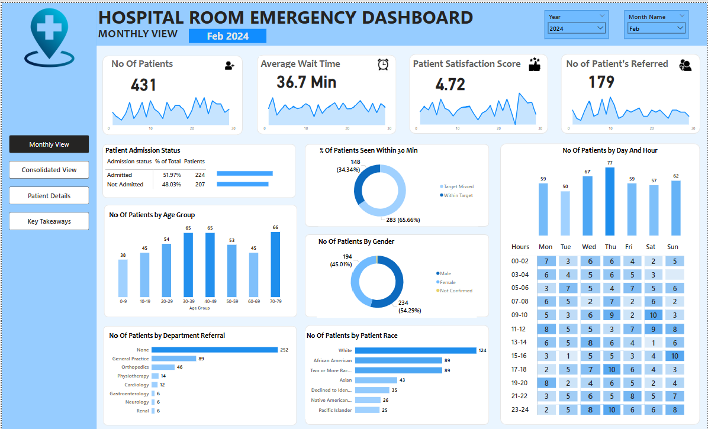

# Hospital-Emergency-Room-Dashboard
# 🏥 Hospital Emergency Room Dashboard

## 📝 Description
This Power BI project presents an interactive dashboard analyzing operations within a hospital’s emergency room (ER). The dashboard offers real-time insights into patient flow, average waiting times, admission rates, and resource utilization. This project is intended for healthcare administrators to make data-driven decisions that improve efficiency and patient outcomes.

## 🎯 Purpose
The goal of this dashboard is to:
- Monitor key performance indicators (KPIs) in the ER.
- Identify bottlenecks in patient flow.
- Improve hospital management decisions with visual analytics.
- Enhance patient care by enabling real-time data-driven decisions.

## 🛠️ Tools & Technologies Used
- **Microsoft Power BI**: for dashboard development and data visualization.
- **DAX (Data Analysis Expressions)**: for data modeling and custom measures.
- **CSV/Excel Dataset** (assumed): as the data source.
- **Power Query**: for data transformation and cleaning.

## 🖼️ Key Visuals

| Visual | Description |
|--------|-------------|
|  | Monthly overview of patient volume, average wait time, and admission status |
|  | Consolidated overview of patient volume, average wait time, and admission status |

## 📈 Analysis of Graphs
1. **Hourly Trends**:
   - Revealed the highest ER visits occur between 6 PM to 9 PM.
   - Lowest activity typically happens in early morning hours (2 AM - 5 AM).

2. **Wait Times**:
   - Average waiting time hovers around 45 minutes.
   - Peak hours see wait times of over 1 hour — indicating resource strain.

3. **Patient Outcomes**:
   - Around 60% of ER patients are discharged within 2 hours.
   - Admission rate fluctuates based on time and weekday patterns.

4. **Resource Utilization**:
   - Specific departments like Trauma and Pediatrics show higher usage during weekends.

## 🧾 Conclusion
This Power BI dashboard empowers hospital management with real-time insights into emergency room operations. With improved visibility into patient trends, wait times, and admission rates, the hospital can:
- Better allocate medical staff.
- Reduce bottlenecks in high-traffic hours.
- Improve the overall ER experience for patients.

